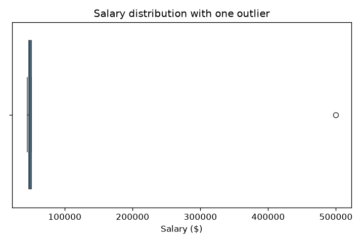

# Seaborn

See [Matplotlib](matplotlib.md#limitations) for the gap this chapter picks up directly — standard statistical chart types taking many lines of raw code.

## What is it?

Seaborn is a Python statistical visualization library built directly on top of Matplotlib, providing high-level functions for common statistical plot types — distributions, categorical comparisons, relationships between variables — with sensible default styling.

If Matplotlib is a drafting table and Plotly adds interactivity, Seaborn is a set of pre-built statistical templates on the same drafting table. Instead of manually plotting points and computing a distribution's shape yourself, you hand Seaborn a dataset and a statistical question — "show me how this variable is distributed across these categories" — and it produces the appropriate plot type with reasonable defaults.

## Why does it exist?

[Matplotlib](matplotlib.md#limitations) named this gap directly: "verbose for standard chart types — a single boxplot-by-category takes noticeably more raw Matplotlib code to reproduce than the equivalent one-line call in a higher-level library built on top of it." Seaborn exists to be exactly that higher-level library, specifically for *statistical* plots — distributions, categorical comparisons, correlation heatmaps — where the "standard chart type" is a specific statistical visualization that would take many lines of manual Matplotlib code to assemble correctly, including computing the underlying statistics yourself.

**When to reach for Seaborn vs. plain Matplotlib vs. Plotly:** reach for Seaborn when the question is a statistical one about a dataset — how a variable's distribution differs across groups, which features correlate — and a quick, well-styled answer is more valuable than infinite customizability. Reach for plain Matplotlib when the exact visual layout needs precise control beyond what Seaborn's statistical templates provide — Seaborn is still built on Matplotlib, so its output can always be customized further with raw Matplotlib calls, but the templates cover most needs directly. Reach for [Plotly](plotly.md) instead when interactivity is what's actually needed — Seaborn, like Matplotlib, produces static images only.

## How does it work?

Seaborn functions typically take a whole DataFrame plus column names as arguments, rather than raw arrays — reflecting a design built around "a dataset and a statistical question," not "here are some x, y arrays to plot." Statistical computation — the quartiles behind a boxplot, a fitted density curve behind a distribution plot — happens automatically internally, not left to the user to compute and plot by hand. Because it's built on Matplotlib, a Seaborn plot still returns a Matplotlib `Axes` underneath, so any Matplotlib customization still applies directly on top of it.

## Example

The exact salary data with one outlier from [Mean](../statistics/mean.md#example), visualized instead of just described:

```python
import seaborn as sns
import matplotlib.pyplot as plt

salaries_with_outlier = [45000, 47000, 48000, 51000, 500000]

fig, ax = plt.subplots(figsize=(6, 4))
sns.boxplot(x=salaries_with_outlier, ax=ax)
ax.set_xlabel("Salary ($)")
ax.set_title("Salary distribution with one outlier")
fig.savefig("salary-outlier.png", dpi=120)
```



`sns.boxplot` computed the quartiles, drew the box and whiskers, and automatically flagged the 500,000 salary as a statistical outlier — using the interquartile-range rule under the hood — from a single line of code. The four ordinary salaries compress into a tight box near the left; the outlier sits visibly, unmistakably separate. Reproducing this exact computation and layout in raw Matplotlib would mean computing the quartiles, the outlier threshold, and the box geometry by hand.

## Where is it used?

Exploratory data analysis (the EDA step from [ML Workflow](../machine-learning/ml-workflow.md)) — checking a feature's distribution, comparing a metric across categories, spotting outliers or skew visually before deciding how to handle them, exactly the kind of check [Mean](../statistics/mean.md) and [Median](../statistics/median.md) argued for doing before trusting a single summary statistic.

## Advantages

- **Standard statistical plots in one line**, computing the underlying statistics automatically rather than requiring manual computation and plotting.
- **Sensible default styling** that looks reasonable without additional customization.
- **Still fully customizable via Matplotlib**, since every Seaborn plot returns a real Matplotlib `Axes` underneath.

## Limitations

- **Static output only**, the same limitation Matplotlib has and [Plotly](plotly.md) exists to address — no zooming, no hovering for exact values.
- **The high-level templates cover common statistical questions, not arbitrary custom visualizations.** A genuinely novel plot type still means dropping down to raw Matplotlib.
- **Automatic statistical choices (like the IQR-based outlier rule shown above) are conventions, not universal truths** — a different outlier definition would flag a different set of points, and Seaborn's default isn't the only reasonable one.

## Production considerations

- **Automated reporting pipelines benefit the most from Seaborn's one-line statistical plots** — generating the same distribution check across many features or many report runs is exactly where the time saved over hand-built Matplotlib compounds.
- **Because Seaborn wraps Matplotlib, it inherits the same non-interactive-backend requirement** already covered in [Matplotlib](matplotlib.md#production-considerations) for generating charts inside automated, headless pipelines.
- **Default statistical choices should be checked against what a report's audience actually needs to see** — an automatically hidden or flagged outlier is a real analytical choice, not a neutral rendering detail.

## Common mistakes

- **Reaching for raw Matplotlib to build a standard statistical plot from scratch**, duplicating work Seaborn already does correctly in one line.
- **Treating Seaborn's automatic outlier flagging as ground truth** rather than one reasonable convention among several, without checking whether it matches the actual analytical question being asked.
- **Forgetting Seaborn plots are still Matplotlib underneath**, and reaching for a different library entirely instead of just customizing the returned `Axes` directly.

## Interview questions

### Basic

- What does Seaborn provide that plain Matplotlib doesn't?
- Why is a Seaborn plot still customizable with Matplotlib code?

### Intermediate

- Why does a Seaborn boxplot require far less code than the equivalent plot built directly in Matplotlib?
- When would you choose plain Matplotlib over Seaborn, even for a statistical plot?

### Advanced

- Seaborn's boxplot flagged a point as an outlier using the IQR rule. Why might that not be the right definition of "outlier" for every dataset?
- How would you decide whether a distribution check belongs in an automated reporting pipeline as a Seaborn plot, versus a one-off exploratory check?
