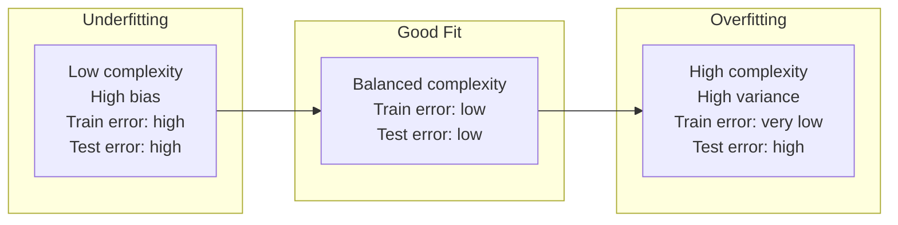

# Bias vs Variance

See [ML Workflow](ml-workflow.md#how-does-it-work) for where evaluation fits in the project lifecycle, and [What is Machine Learning](what-is-machine-learning.md#common-mistakes) for why held-out test data matters in the first place — this chapter explains what that test error is actually telling you.

## What is it?

Bias and variance are the two sources of a model's prediction error:

- **Bias** — error from a model too simple to capture the real pattern in the data. It underfits: it's wrong in the same way on both training and new data.
- **Variance** — error from a model too sensitive to the specific training data it saw. It overfits: it treats noise in the training set as if it were signal, so it performs very differently on new data than on the data it was trained on.

Think of bias as judging every book by one oversimplified rule — "books with a red cover are good" — that ignores everything that actually matters. Think of variance as a student who memorized the exact wording of every practice question, including irrelevant details, and falls apart the moment the real exam phrases a question slightly differently.

## Why does it exist?

Bias and variance pull in opposite directions, which is what makes this a trade-off rather than two separate bugs you can fix independently. A model flexible enough to eliminate bias is, by construction, flexible enough to start fitting noise — which is variance. This framing exists because "the model isn't working" used to be a vague, hard-to-act-on diagnosis; splitting it into bias vs variance turns it into a specific, checkable question with different fixes for each answer.

**When you see high bias** (both train and test error high, and close to each other): the fix is more model capacity, better features, or fewer overly-strong assumptions — not more data, since a model too simple to represent the pattern stays too simple no matter how much data you feed it.

**When you see high variance** (train error much lower than test error): the fix is more training data, regularization, or a simpler model — not a more powerful one, which would only make the gap worse.

## How does it work?

As model complexity increases, training error keeps dropping — a more flexible model can always fit the training data more closely. Test error doesn't follow the same path: it drops at first as bias falls, hits a minimum, then rises again as variance takes over.



The practical diagnostic is the gap between train and test error, not either number alone:

- Both high, close together → high bias.
- Train much lower than test → high variance.
- Both low, close together → a well-balanced model.

## Example

Fitting polynomials of increasing degree to the same noisy data shows all three regions directly.

```python
import numpy as np
from sklearn.model_selection import train_test_split
from sklearn.metrics import mean_squared_error

rng = np.random.default_rng(0)
X = np.linspace(0, 10, 30)
y = np.sin(X) + rng.normal(0, 0.2, size=X.shape)

X_train, X_test, y_train, y_test = train_test_split(X, y, test_size=0.3, random_state=0)

for degree in [1, 9, 15]:
    coeffs = np.polyfit(X_train, y_train, degree)
    train_mse = mean_squared_error(y_train, np.polyval(coeffs, X_train))
    test_mse = mean_squared_error(y_test, np.polyval(coeffs, X_test))
    print(f"degree {degree}: train_mse={train_mse:.4f}, test_mse={test_mse:.4f}")
```

```text
degree 1:  train_mse=0.6133, test_mse=0.5101
degree 9:  train_mse=0.0082, test_mse=0.0644
degree 15: train_mse=0.0044, test_mse=1892.1323
```

A degree-1 line can't follow the curve of a sine wave — both errors are high and close together: high bias. Degree 9 fits the underlying shape well: both errors are low: a good balance. Degree 15 fits the 21 training points almost perfectly (train error of 0.0044) but swings wildly between them, and on the unseen test points the error explodes to 1892.

That last jump isn't just "worse" — it's a different kind of failure. A degree-15 polynomial has more free parameters than the training set has meaningful constraints, so it doesn't approximate the pattern, it memorizes the noise around each specific point. The signature of high variance isn't a small gap; it's exactly this — a model that's excellent on the data it's seen and unreliable the moment it isn't.

## Where is it used?

This diagnostic applies to essentially every supervised model, wherever there's a "how flexible should this model be" choice to make: polynomial degree, decision tree depth, the number of parameters in a neural network, `k` in k-nearest-neighbors, regularization strength. Cross-validation is the standard practical tool for estimating where a model sits on this curve without needing a fresh labeled test set for every experiment.

## Advantages

- Turns "the model isn't working" into a specific, answerable question: is this bias or variance?
- Explains why more data fixes some problems and does nothing for others — a distinction that directly affects whether the right next move is "collect more data" or "simplify the model."
- Gives concrete, opposite-direction levers instead of trial-and-error tweaking.

## Limitations

- Real models have more error sources tangled together than just these two — label noise and distribution shift don't sort neatly into "bias" or "variance," even though their symptoms can look similar.
- The clean mathematical decomposition (error = bias² + variance + irreducible noise) is exact for squared error in regression. The same intuition carries over to classification, but the tidy formula doesn't.
- Diagnosing "which one is it" is easy in a controlled example like the one above. In production, a noisy or small test set can produce a train/test gap that looks like variance without a genuinely unstable model behind it.

## Production considerations

- **Small test sets give misleading gap readings.** A test set that's too small can show a train/test gap from sampling noise alone, not from real model instability — before concluding "high variance," check whether the test set is even large enough to say that with confidence.
- **Drift looks like variance, but isn't.** A growing train/test gap in production can mean the real-world data distribution has moved since training — which shows up identically to variance in the metrics, but needs retraining on fresh data, not a simpler model.
- **Regularization trades one problem for another.** It's the standard production lever for variance, but it introduces its own hyperparameter (how much to regularize) that needs tuning and monitoring — it doesn't remove the tuning burden, it relocates it.

## Common mistakes

- **Treating near-zero training error as a good sign.** It's a prompt to check the test error immediately, not a reason to celebrate — it's exactly what a high-variance model looks like from the training side alone.
- **Assuming "more data" fixes every performance problem.** It helps variance (an overly flexible model with too little to constrain it) and does nothing for bias (a model too simple to represent the pattern, regardless of data volume).
- **Comparing candidate models only on training performance**, which rewards more flexible — and potentially higher-variance — models the same way letting students grade their own memorized-answer exam would.

## Interview questions

### Basic

- What causes bias in a model? What causes variance?
- What does it mean when training error is low but test error is high?

### Intermediate

- Why does adding more training data help a high-variance model but not a high-bias one?
- How would you tell, from train and test error alone, whether a model is underfitting or overfitting?

### Advanced

- A production model's test error just started climbing while train error stayed flat. Is that bias, variance, or something else — and how would you tell the difference?
- Why does the bias-variance decomposition apply cleanly to regression but not as cleanly to classification metrics?
