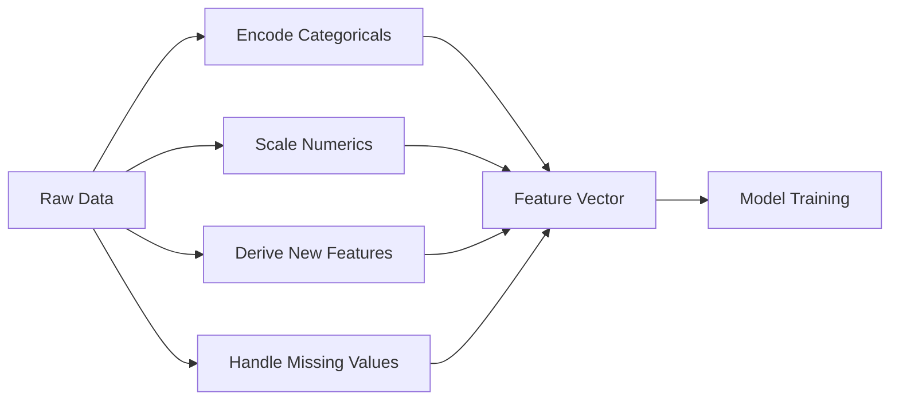

# Feature Engineering

See [ML Workflow](ml-workflow.md#how-does-it-work) for where this fits in the larger project lifecycle — it's the step between EDA and model training.

## What is it?

Feature engineering is the process of transforming raw data into the inputs — **features** — that a model can actually learn from effectively.

Think of raw data as unrefined ore and features as the refined metal a model knows how to work with. A model doesn't understand "medium" as sitting between "small" and "large," or that a raw dollar income and a single-digit year count live on wildly different scales — feature engineering is the translation work that makes that structure visible to the model's math.

## Why does it exist?

A model can only learn a relationship from information it actually receives, in a form it can use. Raw data routinely fails that bar: category strings, mismatched numeric scales, missing values, and dates buried in a single timestamp all carry real signal that a model can't access as-is.

**How much to invest in feature engineering is itself a decision that depends on the model family.** Classical tabular models — linear regression, k-nearest-neighbors, gradient boosting — don't learn their own representations; they work with whatever features you hand them, which is why feature engineering does most of the heavy lifting for tabular ML. Deep learning models on unstructured input (pixels, text tokens) learn their own internal representations directly from near-raw input, which is exactly why feature engineering matters enormously in one setting and far less in the other. Reaching for heavy manual feature engineering on top of a model that already learns representations from raw pixels is usually wasted effort.

## How does it work?

Feature engineering covers a handful of recurring techniques:

- **Encoding categorical variables** — turning categories like `"small"` / `"medium"` / `"large"` into a numeric form (e.g. one-hot encoding).
- **Scaling numeric features** — putting features on comparable numeric ranges, since distance- and gradient-based models are sensitive to scale differences between features.
- **Handling missing values** — imputing or explicitly flagging them, since most models can't handle a missing entry directly.
- **Deriving new features** — turning a raw signal into a more usable one, like a timestamp into "days since last login," or two raw columns into a ratio.



## Example

**Encoding: sometimes the model literally won't run without it.**

```python
import numpy as np
from sklearn.linear_model import LinearRegression

X_raw = np.array([["small"], ["medium"], ["large"], ["medium"], ["small"]])
y = np.array([10, 20, 30, 22, 12])

model = LinearRegression()
model.fit(X_raw, y)
```

```text
ValueError: dtype='numeric' is not compatible with arrays of bytes/strings.
Convert your data to numeric values explicitly instead.
```

Encoding the category first fixes this outright:

```python
from sklearn.preprocessing import OneHotEncoder

encoder = OneHotEncoder(sparse_output=False)
X_encoded = encoder.fit_transform(X_raw)

model = LinearRegression()
model.fit(X_encoded, y)
print(model.predict(encoder.transform([["medium"]])))  # -> [21.]
```

The prediction for `"medium"` (21) is exactly the average of the two `"medium"` training labels (20 and 22) — with only a one-hot category and no other features, that's all a linear model *can* learn: one value per category.

**Scaling: the failure is silent, not an error.**

Unlike the encoding case, a scale mismatch doesn't crash anything — it just quietly produces a bad model. Predicting loan approval from `income` (tens of thousands) and `years_at_company` (single digits) with k-nearest-neighbors, where approval is actually driven by tenure:

```python
import numpy as np
from sklearn.neighbors import KNeighborsClassifier
from sklearn.preprocessing import StandardScaler
from sklearn.model_selection import train_test_split
from sklearn.metrics import accuracy_score

rng = np.random.default_rng(0)
n = 200
years_at_company = rng.uniform(0, 20, n)
income = rng.uniform(20000, 150000, n)  # unrelated to the label
label = (years_at_company >= 10).astype(int)

X = np.column_stack([income, years_at_company])
X_train, X_test, y_train, y_test = train_test_split(X, label, test_size=0.3, random_state=0)

knn_unscaled = KNeighborsClassifier(n_neighbors=5).fit(X_train, y_train)
print(accuracy_score(y_test, knn_unscaled.predict(X_test)))  # -> 0.4667

scaler = StandardScaler().fit(X_train)
knn_scaled = KNeighborsClassifier(n_neighbors=5).fit(scaler.transform(X_train), y_train)
print(accuracy_score(y_test, knn_scaled.predict(scaler.transform(X_test))))  # -> 0.9833
```

The unscaled model scores 46.7% — worse than just guessing the majority class (56.7% of the test set is "approved"). Because `income` ranges in the tens of thousands and `years_at_company` ranges from 0–20, income dominates every distance calculation, and the actual signal (tenure) barely registers. Scaling both features to comparable ranges brings accuracy to 98.3%, with nothing else about the model changed.

## Where is it used?

Wherever a classical model is trained on structured, tabular data: credit scoring, churn prediction, fraud detection (e.g. "transactions in the last hour" derived from raw timestamps), ranking features in recommendation systems, demand forecasting inputs.

## Advantages

- **Often required, not optional** — as the encoding example shows, some models simply can't run on raw, unprocessed input.
- **Bakes domain knowledge directly into the input** — a well-chosen derived feature (like tenure instead of a raw signup date) can matter more than any change to the model itself.
- **Enables simpler, more interpretable models** by doing the representation work up front, instead of relying on a more complex model to learn it implicitly from raw data.

## Limitations

- **Time-consuming and domain-knowledge-heavy** — this step usually takes longer than model training itself, and the diagram in [ML Workflow](ml-workflow.md) doesn't capture that imbalance.
- **Must be reproduced identically at prediction time.** A feature computed one way during training and a slightly different way in production is a live bug, not a training-time concern.
- **Not a free upgrade over deep learning.** Deep models trade hand-engineered features for large amounts of data and compute — a good trade for large unstructured datasets, often a poor one for small tabular datasets where feature engineering plus a simple model wins.

## Production considerations

- **Train-serving skew** — the exact transformation (a fitted scaler's mean/std, an encoder's known categories) must be reused at prediction time, not recomputed independently; a mismatch here produces predictions that are quietly wrong, not obviously broken.
- **Unseen categories in production** — a category that never appeared during training will appear eventually; the encoding strategy needs an explicit policy for it (`handle_unknown` in scikit-learn's `OneHotEncoder`), not a crash.
- **Feature pipelines need their own versioning**, tied to the model version — a changed feature definition is effectively a new model contract, even if the model's code didn't change at all.

## Common mistakes

- **Fitting a scaler or encoder on the full dataset before splitting into train and test.** This leaks test-set statistics into training — a quieter, feature-side version of the same mistake as not holding out test data at all.
- **Scaling features for a tree-based model.** Trees split on a threshold within a single feature at a time, so they're unaffected by scale — scaling them is at best neutral and just adds pipeline complexity for no benefit.
- **Treating feature engineering as a one-time notebook step**, then discovering in production that the live feature pipeline computes something subtly different from what the model was trained on.

## Interview questions

### Basic

- What is a feature, and how is it different from raw data?
- Why does fitting a scikit-learn model directly on raw string categories fail?

### Intermediate

- Why does feature scaling matter for k-nearest-neighbors but not for a decision tree?
- What is train-serving skew, and how would you prevent it?

### Advanced

- Why do image and text models generally need less manual feature engineering than tabular models?
- A production model's accuracy has dropped, and you suspect the feature pipeline rather than the model itself. How would you confirm that before retraining anything?
