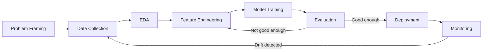

# ML Workflow

This chapter expands the training loop introduced in [What is Machine Learning](what-is-machine-learning.md) into the full sequence of steps a real ML project goes through, from a business question to a deployed, monitored model.

## What is it?

The ML workflow is the ordered set of steps a project moves through to turn a raw problem statement into a model running in production:

1. Problem framing
2. Data collection
3. Exploratory data analysis (EDA)
4. Feature engineering
5. Model training
6. Evaluation
7. Deployment
8. Monitoring and retraining

The loop at the end matters as much as the forward path: a model in production is never really "done" — it's re-evaluated against new data on an ongoing basis.

## Why does it exist?

Before this workflow became standard practice, it was common for a project to go straight from "we have a dataset" to "let's train a model" — skipping problem framing and EDA entirely. That approach produces models quickly, and it also produces models that quietly solve the wrong problem, since nothing forced a check on whether the data represented the real-world cases the model would face.

Think of the workflow as a funnel: each stage exists to filter out one class of failure before it becomes expensive. Skipping a stage doesn't remove that failure — it just moves where you discover it, usually somewhere much more expensive (in production, in front of customers) instead of somewhere cheap (a spreadsheet, during EDA).

Experienced teams still follow this sequence today, even under deadline pressure, because the alternative isn't "faster" — it's "the same problems, discovered later and at higher cost."

## How does it work?

**1. Problem framing** — translate a business question ("reduce customer churn") into a specific, measurable ML task ("predict, for each customer, the probability they cancel in the next 30 days"). This step decides whether the problem is even a good fit for machine learning in the first place, as covered in [What is Machine Learning](what-is-machine-learning.md#common-mistakes).

**2. Data collection** — gather the raw data needed: historical records, logs, labels. This step often reveals that the ideal data doesn't exist yet, forcing a scope change.

**3. Exploratory data analysis (EDA)** — inspect the data before touching a model: distributions, missing values, obvious errors, class imbalance. EDA exists to catch data problems before they get baked into a model.

**4. Feature engineering** — transform raw data into the inputs a model actually trains on, covered in depth in [Feature Engineering](feature-engineering.md).

**5. Model training** — fit a model (or several candidate models) to the training data, as shown in the code examples in [What is Machine Learning](what-is-machine-learning.md) and [Types of Machine Learning](types-of-machine-learning.md).

**6. Evaluation** — measure the model on data it hasn't seen, using a metric tied to the original business question from step 1 — not just a generic statistical score.

**7. Deployment** — make the model available to produce predictions on live input, whether that's a batch job, an API endpoint, or an embedded model.

**8. Monitoring and retraining** — track the model's real-world performance and the statistical properties of incoming data over time, and retrain when they drift too far from what the model was trained on.

## Example

Applying the workflow to a subscription churn problem:

1. **Framing** — "reduce churn" becomes "predict, per customer, the probability of cancellation in the next 30 days," evaluated on precision at the top 10% riskiest customers, since that's the segment the retention team can actually act on.
2. **Data collection** — billing history, support ticket counts, login frequency, plan changes. The team discovers login frequency was only logged starting six months ago, shrinking the usable training window.
3. **EDA** — reveals that 40% of "canceled" records are actually free-trial expirations, not true churn. That gets filtered out before training, not after evaluation.
4. **Feature engineering** — raw login timestamps become "logins in the last 14 days," a feature the model can actually use.
5. **Model training** — a gradient-boosted classifier is trained on the cleaned, featurized data.
6. **Evaluation** — precision at the top decile is checked against a simple baseline (customers who filed a support ticket in the last week) — the model needs to beat that baseline to be worth deploying at all.
7. **Deployment** — the model scores all active customers nightly and pushes the top decile to the retention team's dashboard.
8. **Monitoring** — three months in, precision quietly drops; a pricing change shifted customer behavior in a way the training data never saw, triggering a retraining cycle.

Notice that step 3 — filtering out free-trial expirations — is the kind of fix that's nearly free to make during EDA and very expensive to diagnose after a model is already deployed and underperforming for reasons nobody can immediately explain.

## Where is it used?

This workflow applies across essentially every ML project, regardless of domain — fraud detection, recommendation systems, demand forecasting, medical diagnosis support. The steps are the same; what changes is how much effort each step takes. A fraud model might need heavy feature engineering and near-real-time monitoring; a one-off research model might skip deployment and monitoring entirely.

## Advantages

- **Surfaces problems early**, when they're cheap to fix — a data quality issue found during EDA is far cheaper than one found after deployment.
- **Keeps the model tied to the original business question**, instead of drifting toward optimizing a metric that's easy to measure but doesn't matter.
- **Makes the project's progress legible** to people outside the ML team, since each stage has a concrete, checkable output.

## Limitations

- **It's not strictly linear in practice.** Real projects loop back constantly — a modeling result often sends you back to feature engineering or even problem framing, and the diagram's forward arrows undersell how much iteration actually happens.
- **The workflow doesn't guarantee a good outcome.** Following every step carefully can still produce a model that isn't good enough to ship; it reduces wasted effort, it doesn't guarantee success.
- **Effort isn't evenly distributed, and the diagram hides that.** In most real projects, data collection and feature engineering take far longer than model training — often the majority of total project time — while the diagram gives each box equal visual weight.

## Production considerations

- **Reproducibility** — every step (data version, feature transformations, model version) needs to be re-creatable, not just the final model file; without this, debugging a production regression means guessing which upstream change caused it.
- **Handoffs between roles** — data engineers, ML engineers, and business stakeholders typically own different stages; unclear ownership at the boundaries (e.g. "who owns feature definitions?") is a common, recurring source of production bugs that looks like a modeling problem but isn't.
- **Automation over time** — early on, most steps are manual and exploratory; in a mature production system, steps 2 through 8 are usually automated into a pipeline that reruns on a schedule or trigger, and that automation itself becomes something that needs monitoring.

## Common mistakes

- **Skipping EDA and going straight to model training**, then spending days debugging confusing model behavior that a ten-minute look at the data would have explained.
- **Choosing an evaluation metric for convenience** (e.g. plain accuracy on an imbalanced dataset) instead of one that reflects the real business cost of errors — a model can look excellent on the wrong metric and be worthless in practice.
- **Treating deployment as the last step.** Without monitoring, a model that was accurate at launch can silently degrade as real-world data shifts, and nobody notices until the business impact shows up elsewhere first.
- **Iterating only on the model** when the bigger opportunity is upstream. Engineers with a modeling background tend to reach for a different algorithm before checking whether better features or better problem framing would move the needle more.

## Interview questions

### Basic

- Walk through the steps you'd take from "the business wants to reduce churn" to a deployed model.
- What's the difference between EDA and feature engineering?

### Intermediate

- Why might a model with 99% accuracy still be a bad model?
- Why is monitoring necessary even after a model performs well at launch?

### Advanced

- Describe a real scenario where you'd go back to an earlier step in the workflow after evaluation, and explain what signal would trigger that.
- How would you design a pipeline so that a model's predictions from six months ago are still fully reproducible today?
