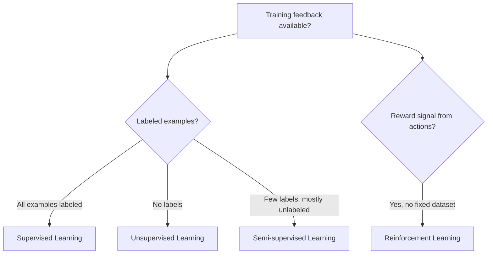

# Types of Machine Learning

See [What is Machine Learning](what-is-machine-learning.md) for the base definitions of a model and the train/predict loop this chapter builds on.

## What is it?

Machine learning problems are grouped into a few broad categories, based on what kind of feedback the training data provides:

- **Supervised learning** — the training data includes the correct answer for each example (a **label**). The model learns to map input to that known answer.
- **Unsupervised learning** — the training data has no labels. The model finds structure in the data on its own, such as grouping similar examples together.
- **Semi-supervised learning** — most of the training data is unlabeled, with only a small labeled subset. The model uses both.
- **Reinforcement learning** — there's no fixed dataset at all. An agent takes actions in an environment and learns from a reward signal that tells it how good or bad the outcome was.

Think of the difference this way: supervised learning is studying with an answer key, unsupervised learning is sorting a pile of photos into groups with no captions to guide you, and reinforcement learning is learning to ride a bike — nobody labels each movement "correct" or "incorrect," you just feel the outcome (staying upright or falling) and adjust.



## Why does it exist?

Before this categorization was common, ML was often approached as one undifferentiated problem: "fit a model to data." That framing hides an important distinction — the algorithms that work on labeled data (like predicting house prices) are structurally unable to work on unlabeled data (like grouping customers with no predefined segments), because there's no "correct answer" to measure error against.

This categorization exists because the kind of feedback available in a problem determines which algorithms can even be applied to it, before any comparison of specific model choices happens.

Some problems come with clear correct answers already recorded — historical loan defaults, past house sale prices, emails already marked as spam. That data supports supervised learning. Other problems have no correct answer to learn from — nobody labeled "which customers are similar to each other" — so that data only supports unsupervised learning. And some problems don't have a dataset at all before you start; a game-playing agent or a robot has to try actions and observe outcomes, which is what reinforcement learning is for.

Engineers still reach for this categorization first, before picking a specific algorithm, because getting it wrong wastes far more time than a slightly suboptimal model choice within the right category.

## How does it work?

**Supervised learning** splits further into two problem types:

- **Classification** — predicting a category (e.g. spam or not spam).
- **Regression** — predicting a number (e.g. a house price, as in the [previous chapter](what-is-machine-learning.md)).

Beginners often assume these are the same problem with a different output type. They're not: the loss function a classifier minimizes (how wrong a predicted category is) and the one a regressor minimizes (how far off a predicted number is) are fundamentally different, and so are the evaluation metrics — accuracy makes no sense for a house price prediction, and mean squared error makes no sense for spam detection.

**Unsupervised learning**, most commonly, finds structure by clustering similar points together — no target to predict, no per-example "correct" grouping to check against.

**Reinforcement learning** is structurally different from both: instead of fitting a model to a fixed dataset, an agent repeatedly takes an action, observes a reward, and updates its strategy based on that reward. It's covered in more depth later in this handbook, once agent architecture has been introduced.

## Example

A minimal classification example, predicting whether a student passes based on hours studied:

```python
import numpy as np
from sklearn.linear_model import LogisticRegression

# Training data: hours studied -> passed (1) or failed (0)
X = np.array([[1], [2], [3], [4], [5], [6], [7], [8]])
y = np.array([0, 0, 0, 0, 1, 1, 1, 1])

model = LogisticRegression()
model.fit(X, y)

print(model.predict([[4.5]]))       # -> [0]
print(model.predict_proba([[4.5]])) # -> [[0.500, 0.500]] (roughly)
```

4.5 hours sits exactly between the last observed failure (4 hours) and the first observed pass (5 hours) — and the model's output reflects that: it predicts class 0, but the probability is almost exactly 50/50. That's not a bug or a rounding artifact; it's the model correctly expressing that this input is right on the decision boundary, not a case it's confident about. Reading only the predicted class and ignoring `predict_proba` would hide that uncertainty entirely.

And a minimal clustering example — unsupervised, with no labels at all:

```python
import numpy as np
from sklearn.cluster import KMeans

X = np.array([[1, 2], [1, 4], [1, 0],
              [10, 2], [10, 4], [10, 0]])

kmeans = KMeans(n_clusters=2, random_state=0, n_init="auto").fit(X)

print(kmeans.labels_)           # -> [1 1 1 0 0 0]
print(kmeans.cluster_centers_)  # -> [[10. 2.] [1. 2.]]
```

`KMeans` groups the six points into two clusters purely from their positions — nothing in the data told it which group is "correct."

## Where is it used?

- **Supervised** — spam filtering, price prediction, medical diagnosis from labeled scans, credit scoring.
- **Unsupervised** — customer segmentation, anomaly detection, topic discovery in documents.
- **Semi-supervised** — situations where labeling is expensive, such as medical images, where a small labeled set is combined with a large unlabeled one.
- **Reinforcement learning** — game-playing agents, robotics, resource allocation, recommendation systems optimizing for long-term engagement.

## Advantages

- **Matches the tool to the data you actually have** before comparing specific algorithms, which narrows the search space considerably.
- **Clarifies what "correct" means for a given problem.** Supervised problems have a clear per-example correctness signal; unsupervised ones don't, which changes how you evaluate the result, not just how you train it.
- **Makes trade-offs explicit.** Recognizing a problem as semi-supervised immediately surfaces the real trade-off: spend budget labeling more data, or get more value out of the unlabeled data already sitting in storage.

## Limitations

- **Real problems often don't fit one category cleanly.** A recommendation system might combine supervised ranking with reinforcement-learning-based exploration — the clean taxonomy is a starting point, not the final architecture.
- **The category doesn't guarantee a good result.** Correctly identifying a problem as "supervised classification" still leaves the hard work of picking features, an algorithm, and evaluation metrics.
- **Reinforcement learning looks appealing precisely because it needs no labels — that's also its biggest catch.** It needs a safe environment to experiment in, which most business problems don't have (you can't let a pricing agent "explore" by randomly overcharging real customers). In practice, RL is usually the last option considered, not the first, despite how often it gets reached for early.

## Production considerations

- **Labeling pipelines** — supervised systems need a process to produce, store, and version labels, not just raw data; labeling drift (definitions changing over time) is a common, hard-to-detect production bug.
- **Cold-start behavior** — reinforcement learning agents and clustering-based systems can behave poorly before they've accumulated enough experience or data; production systems need a defined fallback for that period, not just "wait for it to learn."
- **Silent clustering degeneracy** — an unsupervised model can collapse into a few dominant clusters (or one) as input data shifts, and because there's no ground truth to compare against, this can go unnoticed far longer than a supervised model's accuracy drop would.
- **Evaluation differs by category** — classification and regression have standard automated metrics; clustering and reinforcement learning are harder to evaluate automatically and often need a human-reviewed proxy metric, which is slower and easier to skip under deadline pressure.

## Common mistakes

- **Defaulting to supervised learning because it's the most familiar**, even when labels don't exist or would be prohibitively expensive to produce — then burning the project's budget on a labeling effort instead of considering an unsupervised or semi-supervised approach.
- **Treating clustering output as ground truth.** Cluster labels are the model's own grouping, not a verified category — they still need a human to check whether the grouping actually means something useful.
- **Reaching for reinforcement learning because it sounds more sophisticated**, when the problem has perfectly good historical labeled data sitting unused and would train faster and more predictably as a supervised problem.

## Interview questions

### Basic

- What's the difference between classification and regression?
- What distinguishes supervised from unsupervised learning?

### Intermediate

- How would you evaluate an unsupervised clustering result, given there are no ground-truth labels?
- When would semi-supervised learning be preferable to fully supervised learning?

### Advanced

- Why is reinforcement learning often the wrong first choice for a business problem, even when it seems like a natural fit?
- Describe how you'd detect that a production clustering model has silently degenerated (e.g. collapsed into one dominant cluster).
