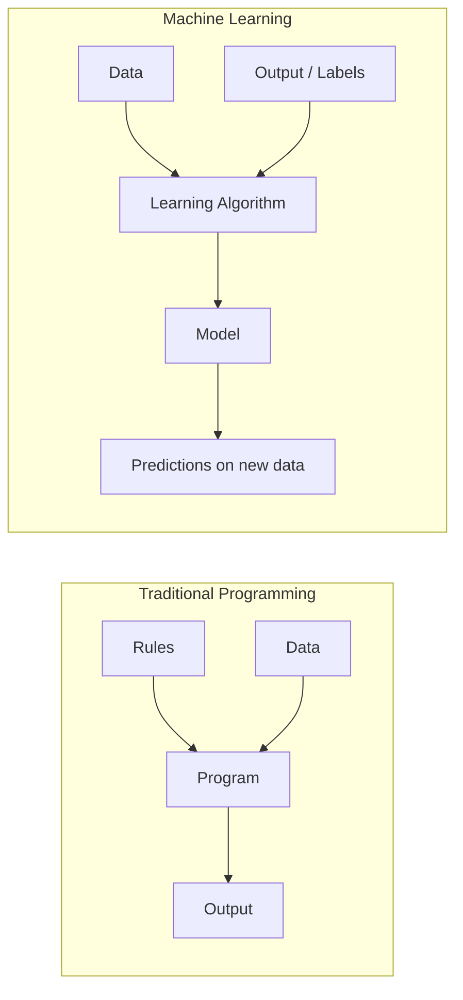

# What is Machine Learning

## What is it?

Machine Learning (ML) is a way of building software that learns patterns directly from data, instead of following rules a programmer writes by hand.

In traditional programming, you write the rules yourself: given input and rules, the program produces output. In machine learning, you give the computer example inputs and their correct outputs, and it works out the rules — expressed as a mathematical function called a **model** — on its own.



A model is the learned function. Once trained, it takes input it has never seen before and produces a prediction, based on the patterns it found in the training data.

## Why does it exist?

Some problems are too complex, too variable, or too poorly understood to describe as a fixed set of rules.

Take spam detection. Spam changes constantly — new wording, new tactics, new senders. Hand-written rules ("block emails containing the word 'lottery'") break down quickly: spammers adapt, and legitimate emails get blocked too.

Machine learning exists for exactly this class of problem: the relationship between input and output is real, but too complicated for a person to write down explicitly. Instead of hand-coding the relationship, you give the computer many examples of input and correct output, and let it approximate the relationship statistically.

This became practical once two things arrived together:

- **Data availability** — digital systems now generate large amounts of labeled and unlabeled data.
- **Compute availability** — training that used to take days now takes minutes, due to cheaper storage and faster hardware (notably GPUs).

## How does it work?

Every ML system follows the same basic loop:

1. **Collect data** — examples relevant to the problem (e.g. house features and their sale prices).
2. **Train a model** — an algorithm searches for a mathematical relationship between the input (features) and the output (target) that minimizes prediction error on the training data.
3. **Evaluate the model** — test it on data it did not see during training, to check whether it generalizes rather than memorizes.
4. **Use the model** — deploy it to make predictions on new, real-world input.
5. **Monitor and retrain** — real-world data changes over time, so the model is re-evaluated and retrained periodically.

Here's a minimal example: predicting a house's price from its size, using scikit-learn's `LinearRegression`.

```python
import numpy as np
from sklearn.linear_model import LinearRegression

# Training data: house size in square meters -> price in $1000s
X = np.array([[50], [65], [80], [100], [120]])
y = np.array([150, 190, 230, 280, 330])

model = LinearRegression()
model.fit(X, y)

# Predict the price of a 90 square meter house
predicted_price = model.predict(np.array([[90]]))
print(predicted_price)  # -> roughly 254 (i.e. $254,000)
```

`model.fit(X, y)` is where learning happens: the algorithm finds the line that best fits the training examples. `model.predict(...)` applies that learned relationship to new input.

This example is intentionally simple — one algorithm (linear regression) on one type of problem (predicting a number). Other problems need different algorithms; the categories of problems and algorithms are covered in later chapters.

## Where is it used?

ML is used wherever a system needs to make decisions or predictions from patterns in data, rather than fixed rules:

- **Recommendation systems** — suggesting products, videos, or content based on past behavior.
- **Fraud detection** — flagging transactions that resemble known fraud patterns.
- **Spam and content filtering** — classifying email or posts as spam, abusive, or safe.
- **Computer vision** — recognizing objects, faces, or defects in images.
- **Speech and language** — transcription, translation, and the large language models behind modern chatbots.
- **Forecasting** — predicting demand, prices, or resource usage.
- **Predictive maintenance** — estimating when a machine part is likely to fail.

## Advantages

- **Handles complexity rules can't** — captures relationships too intricate to hand-code.
- **Improves with more data** — performance typically gets better as more relevant training data becomes available.
- **Finds patterns humans miss** — can surface correlations in high-dimensional data that aren't obvious by inspection.
- **Generalizes across similar problems** — the same class of algorithm (e.g. classification) can be reused across many different domains.

## Limitations

- **Needs enough quality data** — a model is only as good as the data it learns from; biased or insufficient data produces a biased or inaccurate model.
- **Limited interpretability** — some models, especially deep learning ones, are hard to explain, which matters in regulated domains like finance or healthcare.
- **Encodes and can amplify bias** — if the training data reflects historical bias, the model reproduces it.
- **Fails silently on unfamiliar input** — a model still produces a confident-looking prediction on input very different from its training data, with no built-in warning.
- **Ongoing cost** — models degrade as real-world data drifts away from training data, requiring monitoring and retraining.

## Production considerations

Building a working model in a notebook is different from running ML in production. Production systems need:

- **Data pipelines** — reliable, versioned data feeding the model, both for training and for live predictions.
- **Model versioning** — tracking which model version produced which prediction, so results are reproducible.
- **Monitoring for drift** — detecting when real-world input starts to diverge from training data, since accuracy degrades silently otherwise.
- **A retraining strategy** — deciding how often, and on what trigger, the model gets retrained.
- **Latency and scale requirements** — a fraud-detection model scoring transactions in real time has very different constraints from a monthly demand forecast.
- **A clear evaluation metric tied to the business outcome** — a model can score well statistically and still fail to move the metric the business actually cares about.

## Common mistakes

- **Reaching for ML before checking if a simpler rule-based solution works.** ML adds real cost — data collection, training, monitoring — and isn't the default choice for every problem.
- **Skipping a baseline.** Without comparing to a simple baseline (e.g. always predicting the average), it's hard to know if the model adds any value.
- **Not holding out test data.** Evaluating a model only on the data it was trained on hides overfitting and overstates real performance.
- **Ignoring data quality.** Feeding a model incomplete, mislabeled, or unrepresentative data, then blaming the algorithm when it performs poorly.
- **Deploying without a monitoring plan.** Treating training as the finish line, rather than the start of an ongoing maintenance responsibility.

## Interview questions

- What is the difference between traditional programming and machine learning?
- Why would you choose a machine learning approach over a rule-based system for a given problem?
- What is a model, in the context of machine learning?
- What is overfitting, and how would you detect it?
- Give an example of a problem where machine learning is the wrong tool. Why?
